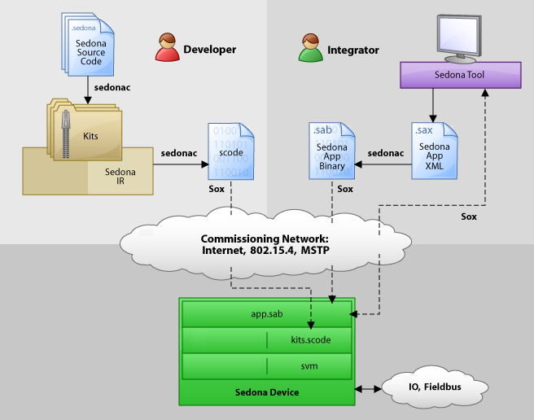

<!--
[//]: # (Copyright &#169; 2007 Tridium, Inc
  Licensed under the Academic Free License version 3.0

  History:
    29 Mar 07  Brian Frank  Creation
) -->

# Architecture

## Actors

One of the goals of the Sedona Framework is to empower non-programmers to graphically assemble applications by wiring together predefined components. It is useful to consider two primary **<i>actors</i>** involved in building Sedona Framework applications:

- <b>Developers</b> are software engineers who write <i>components</i> using the Sedona programming language.  These components include function blocks, I/O drivers, and packaged applications. Components are then bundled into modules and deployed as <i>kits</i>

- <b>Integrators</b> are typically domain experts who use graphical tools to assemble applications from the components written by developers.  Components are configured via their properties and wired together with <i>links</i>

In the real world, users don't fit into these two buckets
so cleanly - many belong to both camps.  But characterizing
users according to these two actors is useful for discussion.

## Sedona Language

Sedona Framework applications all start with software written in the [Sedona programming language](/language/lang).  The Sedona language is based on Java and C# - so if you are familiar with those languages then you should have no problem learning Sedona.  Key characteristics of the Sedona language include:

- Familiar Java/C# syntax
- Object oriented (inheritance, polymorphism, all that good stuff)
- Component oriented (first class properties and actions, reflection, graphical assembly)
- Single inheritance only (no interfaces)
- Static memory model (components cannot create new objects at runtime)
- Semicolons are optional as statement separator

## Components

The Sedona Framework's standard API includes a special class called <code>Component</code>. Classes that extend <code>Component</code> are designed to be
used by integrators to assemble applications.  All components have
the following characteristics designed to enable component-oriented
application assembly:

- Two byte component id for identity and naming inside an application
- A short ASCII character name as a human label
- Designed to be organized into a tree structure similar to your file system
- Reflective <i>type</i>
- Named set of reflective <i>slots</i>

Slots are the members of a component class that specify how
the component is exposed to an integrator during the assembly
process.  There are two types of slots: <i>property</i> defines
a configuration or runtime variable and <i>action</i> defines a
command that can be invoked.

## Kits

Developers write software organized into classes much
like C++, Java, or C#.  These classes are then packaged up
into a <i>kit</i>.  A kit is the primary unit of deployment,
versioning, and naming in the Sedona Framework.  A kit
is like a Java JAR file or a .NET DLL.

Kits are stored as a single file that ends with the ".kit" extension.
The file itself is a standard archive file you can open using
your favorite 'zip' tool.  Inside the kit file is an XML [manifest](/deployment/schema#kit-parts) file that specifies
meta-data about the kit such as its name, version, vendor,
and description.  The manifest also enumerates all the kit's
component types that are available for constructing applications.

Kits are compiled from Sedona language source code using
the <code>sedonac</code> compiler.  During compilation, all
the classes in the kit are checked for validity and compiled
into a special format called <i>IR</i> for <i>intermediate
representation</i>.  The IR format is a text based "assembly
language".  IR code is portable, which means one kit
file can be deployed for all platforms.

## SCode

Sedona Framework software deployed as kits still isn't quite ready for execution.
Even though we've compiled source language down to IR, we still
don't have a format suitable for machine execution.  The next step
is to compile a set of kits into a single file called an <i>scode
image</i>.  SCode is a very compact, binary representation of the
code, designed to be executed directly by the Sedona VM.

The <code>sedonac</code> compiler is used to compile a set of kits
into a binary ".scode" file.  During this compilation process the
following tasks are performed:

- Layout method code in memory
- Layout fields in memory
- Layout reflection meta-data in memory
- Optimize for big-endian or little-endian
- Optimize for native platform pointer size
- Link method calls to their memory locations

To maximize performance, sedonac optimizes the scode for a specific
platform's endianness and pointer size; this means that an scode image is not
portable to other platforms.

## Sedona Virtual Machine

Once a set of kits has been compiled into an scode file, we can
run the scode using the <i>Sedona Virtual Machine</i>,
or <i>SVM</i> for short.  The SVM interprets the scode
and brings Sedona programs to life!

The SVM itself is written in ANSI C and compiled for a target
hardware platform.  See the [Porting](/development/porting/)
chapter for instructions to get the SVM running on your target
device.

## Sedona Framework Applications

Writing code in the Sedona programming language and building
kits is the domain of developers.  Developers build libraries
of ready-to-use components deployed as kits.  Integrators
can then use graphical programming tools to design <i>applications</i> by assembling and linking component instances.

Due to their dynamic nature, Sedona Framework applications are modeled and
persisted differently from kits and scode.  A Sedona Framework application
is modeled as a tree of components.  Each component is assigned
a unique two byte identifier and a custom name.  Components
instances may also be customized via their configuration properties.
Links are used to establish relationships between components
to specify data and event flow within the application.

Sedona Framework applications may be stored in two different file formats.
The <i>Sedona Application XML</i> format uses the ".sax" file
extension, and is a human-readable XML file.
The <i>Sedona Application Binary</i> format uses
the ".sab" file extension and is a compact binary representation
of the application.  The binary format is the one used
at runtime on Sedona Framework-enabled devices.  The <code>sedonac</code>
tool can be used to convert between the file formats.

## Sedona Framework Devices

Of course the end goal of the Sedona Framework is to create programmable
smart devices.  This is where everything comes together.
The typical process of Sedona Framework-enabling a device:

- Port the SVM to the device's hardware platform
- Run the _SVM_ on the device (typically loaded or run from flash memory on startup)
- Commission the device with an _scode_ image. This allows integrators
to pick their own kits to use for applications. In devices with limited
resources the scode may be fixed or even in ROM. More typically, the scode is
stored in flash memory and the location of the image passed to the VM at boot time
- Load the _sab_ application file. The integrator may write a complete application
to the device; applications can also be modified dynamically on the device while it is running.  At the other extreme, such as for a small, dedicated device,
the application might be fixed or stored in ROM

## Workflow

The diagram below illustrates the workflow for building and
deploying Sedona Framework applications to devices.

The Sedona <b>developer</b> workflow typically involves these steps:

1. Build library of components in the Sedona programming language
2. Components are compiled into kits using sedonac
3. Developers or integrators will choose which kits to install onto a device,
and then sedonac is used to link the kits into a binary scode image (this
step is often done under the covers by a high level tool)
4. The SVM and scode are loaded onto the device.  These
files may be predefined such as in ROM, or may be dynamically provisioned
over the network using the Sox protocol

System <b>integrators</b> are usually domain experts who build Sedona applications
by "wiring together" the components provided by developers. These users typically use
graphical tools to assemble applications. Applications may be modified remotely
on a running device using the Sox protocol, or they may be built offline and
stored in a "sax" file. If the app is built offline, then it compiled into
a "sab" file with sedonac and installed on the device at commissioning time
using the Sox protocol.
